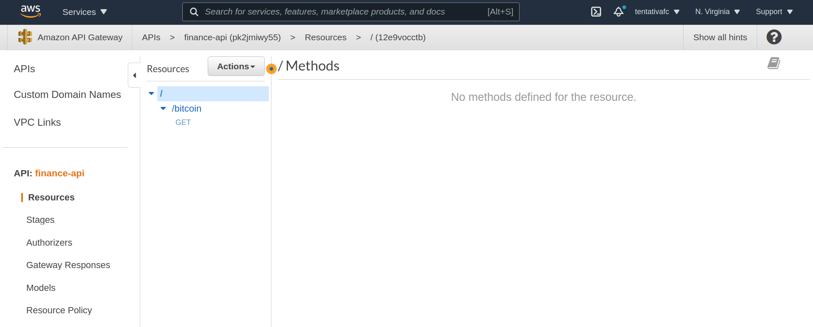
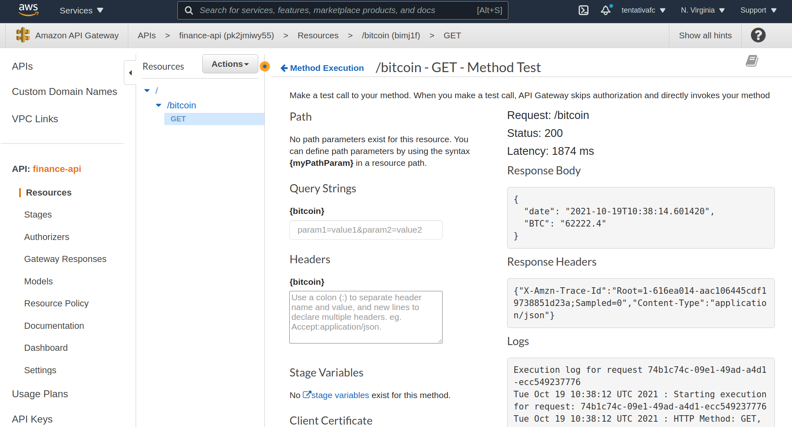

# API Gateway

Recipes with Apigateway.

## Lambda Environment

```sh
python3 -m venv env
source env/bin/activate
pip install -r requirements.txt
```

## Package Lambda

```sh
sh make.sh
```

## Create Infra

```sh
terraform init
terraform apply -auto-approve
```



## Execuction APIGateway


