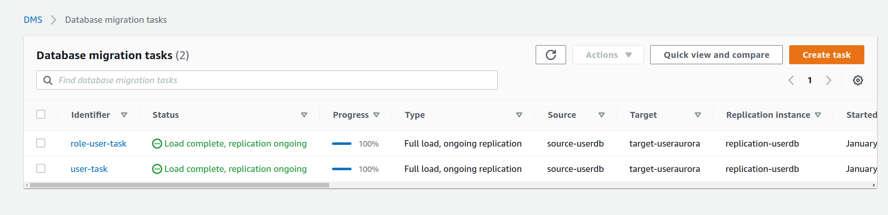
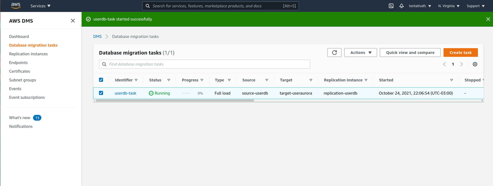
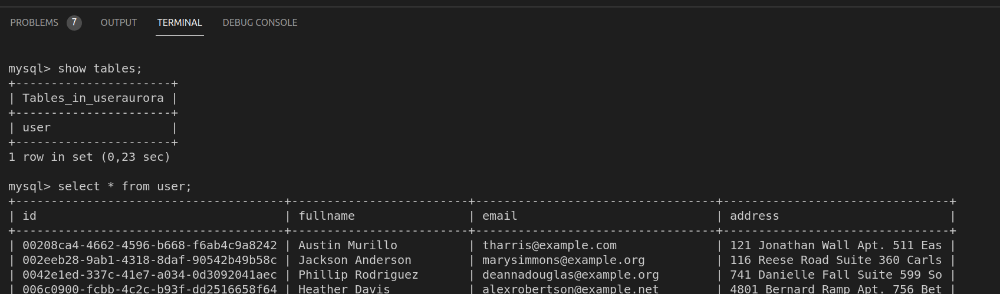

# DMS

Use DMS for data migration.

## Pre reqs.

For this recipe, you neeed have a DB Instance RDS (Source) and an Aurora Mysql RDS (Target).

Follow the [RDS instructions](https://github.com/ortisan/aws-terraform-recipes/tree/main/rds/README.md) to provisione RDS source and target.

## Environment

Change values of region, connections of source and target endpoints and security infos like security group and if you need KMS.

```sh
terraform init
terraform apply -auto-approve
```

After starting task, the tables will be migrate:

Starting task:


End taks:


Result:



### Docs:

https://docs.aws.amazon.com/dms/latest/userguide/CHAP_Introduction.HighLevelView.html