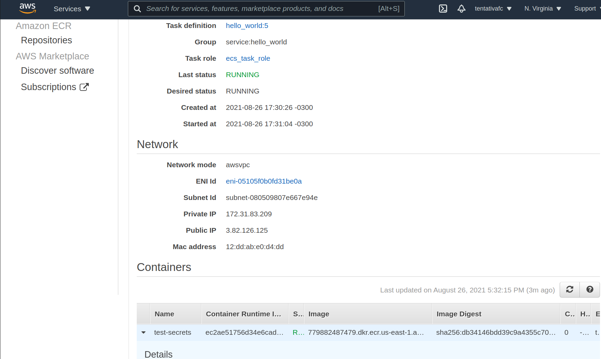
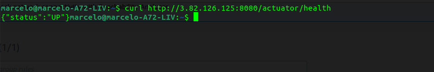

# ECS Fargate Cluster

This demo demonstrate how create ECS Cluster using Fargate mode.

## Create Infra

```sh
terraform init
terraform apply -auto-approve
```

## Testing

1. Get public ip:



2. Make calls:

```sh
# Healthcheck
curl http://3.82.126.125:8080/actuator/health
# Route
curl http://3.82.126.125:8080/test
```

