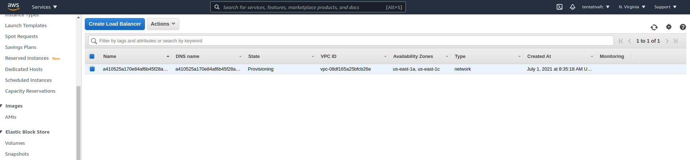

# Config Istio Manually on EKS

```sh
# Creates using eksctl
eksctl create cluster --name test --version 1.19 --region us-east-1 --nodegroup-name ng-poc-1 --node-type t2.medium --nodes 1 --nodes-min 1 --nodes-max 3 --managed
# Delete if you need
eksctl delete cluster --name test


kubectl apply -f k8s/hello-world.yaml
kubectl get pods
kubectl expose pod nginx --port 80 --type=LoadBalancer

# Enable security group to allow any traffic and then

curl $(kubectl -n default get service nginx -o jsonpath='{.status.loadBalancer.ingress[0].hostname}')

kubectl delete svc/nginx

#Download Istio
curl -L https://istio.io/downloadIstio | sh -

cd istio-1.10.2/

## INSTALL ISTIO WITH HELM
kubectl create namespace istio-system

# Install Istio base chart
helm install istio-base ./manifests/charts/base -n istio-system

# Install Istio discovery chart
helm install istiod ./manifests/charts/istio-control/istio-discovery -n istio-system

# By default, creates an classic load balancer
# Edit values, put
# serviceAnnotations: {
# "service.beta.kubernetes.io/aws-load-balancer-type": "nlb"
# } OR EXECUTE WITH SET
# Install Istio ingress chart
helm install istio-ingress ./manifests/charts/gateways/istio-ingress -n istio-system --set 'gateways.istio-ingressgateway.serviceAnnotations.service\.beta\.kubernetes\.io/aws-load-balancer-type=nlb'

service.beta.kubernetes.io/

helm lint ./manifests/charts/gateways/istio-ingress

helm uninstall istio-ingress

# Check installation
kubectl get pods -n istio-system
kubectl get svc -n istio-system

# Enable default injection sidecar on default namespace
kubectl label namespace default istio-injection=enabled

# Deploy Book Info Demo
kubectl apply -f samples/bookinfo/platform/kube/bookinfo.yaml

# Check installation
kubectl get pods
kubectl get svc --all-namepaces

# Results
(base) marcelo@marcelo:~/Documents/Ambiente/Projetos/config-eks-private-subnet/istio-1.10.2$ kubectl get svc --all-namespaces
NAMESPACE      NAME                   TYPE           CLUSTER-IP       EXTERNAL-IP                                                                     PORT(S)                                      AGE
default        details                ClusterIP      10.100.5.229     <none>                                                                          9080/TCP                                     70m
default        kubernetes             ClusterIP      10.100.0.1       <none>                                                                          443/TCP                                      121m
default        productpage            ClusterIP      10.100.210.84    <none>                                                                          9080/TCP                                     70m
default        ratings                ClusterIP      10.100.91.62     <none>                                                                          9080/TCP                                     70m
default        reviews                ClusterIP      10.100.156.61    <none>                                                                          9080/TCP                                     70m
istio-system   istio-egressgateway    ClusterIP      10.100.76.160    <none>                                                                          80/TCP,443/TCP,15443/TCP                     75m
istio-system   istio-ingressgateway   LoadBalancer   10.100.223.101   a410525a170e84af6b45f28a96441059-b1dabed2087cb6b7.elb.us-east-1.amazonaws.com   15021:32158/TCP,80:32422/TCP,443:31902/TCP   64s
istio-system   istiod                 ClusterIP      10.100.54.1      <none>                                                                          15010/TCP,15012/TCP,443/TCP,15014/TCP        76m
kube-system    kube-dns               ClusterIP      10.100.0.10      <none>                                                                          53/UDP,53/TCP                                121m
(base) marcelo@marcelo:~/Documents/Ambiente/Projetos/config-eks-private-subnet/istio-1.10.2$
```



```sh
# Delete after test
eksctl delete cluster --name test
```

### Useful HELM commands

```sh
helm ls --all-namespaces

helm uninstall istio-ingress -n istio-system

```
