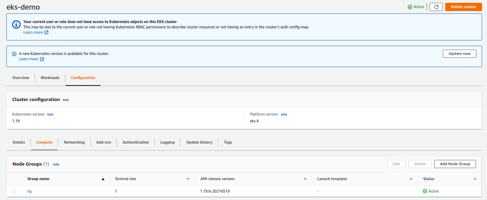

# Simple EKS

Slim config for private EKS cluster



### Troubleshooting:

#### [Install Kubectl Bastion](https://docs.aws.amazon.com/pt_br/eks/latest/userguide/install-kubectl.html):

```sh
curl -o kubectl https://amazon-eks.s3.us-west-2.amazonaws.com/1.19.6/2021-01-05/bin/linux/amd64/kubectl

chmod +x ./kubectl

mkdir -p $HOME/bin && cp ./kubectl $HOME/bin/kubectl && export PATH=$PATH:$HOME/bin
```

#### [Configure Kubeconfig Bastion](https://docs.aws.amazon.com/eks/latest/userguide/create-kubeconfig.html):

```sh
aws eks --region us-east-1 update-kubeconfig --name eks-demo
```

#### [Configure ECR Repository](https://docs.aws.amazon.com/pt_br/AmazonECR/latest/userguide/getting-started-cli.html)

```sh
aws ecr create-repository \
    --repository-name hello-world \
    --image-scanning-configuration scanOnPush=false \
    --region us-east-1


aws ecr get-login-password --region us-east-1 | docker login --username AWS --password-stdin 779882487479.dkr.ecr.us-east-1.amazonaws.com

docker run -t -i -p 80:80 hello-world

docker images

docker tag hello-world:latest 779882487479.dkr.ecr.us-east-1.amazonaws.com/hello-world:latest

docker push 779882487479.dkr.ecr.us-east-1.amazonaws.com/hello-world:latest

```

#### Configure Helm

```sh
curl -fsSL -o get_helm.sh https://raw.githubusercontent.com/helm/helm/master/scripts/get-helm-3
chmod 700 get_helm.sh
./get_helm.sh

```

https://aws.amazon.com/pt/blogs/startups/from-zero-to-eks-with-terraform-and-helm/

https://A5034521D741EE9B0CA56102140B5C1C.gr7.us-east-1.eks.amazonaws.com
curl --cacert ca.crt https://A5034521D741EE9B0CA56102140B5C1C.gr7.us-east-1.eks.amazonaws.com

Important:
https://aws.amazon.com/pt/premiumsupport/knowledge-center/eks-api-server-endpoint-failed/

Note: In private access mode, you can access the Amazon EKS API endpoint only from within the cluster's VPC.

https://aws.amazon.com/pt/blogs/compute/enabling-dns-resolution-for-amazon-eks-cluster-endpoints/

### HELM Tests

```sh
aws eks describe-cluster --name eks-demo --query cluster.resourcesVpcConfig.clusterSecurityGroupId


aws eks --region us-east-1 update-kubeconfig --name eks-demo


export HELM_EXPERIMENTAL_OCI=1

aws ecr get-login-password \
     --region us-east-1 | helm registry login \
     --username AWS \
     --password-stdin 123456.dkr.ecr.us-east-1.amazonaws.com


ACCOUNT_ID.dkr.ecr.us-east-1.amazonaws.com


#
# RUN me where kubectl is available,& make sure to replace account,region etc
#
ACCOUNT=ACCOUNT_ID
REGION=us-east-1
SECRET_NAME=${REGION}-ecr-registry
EMAIL=tentativafc@gmail.com

#
# Fetch token (which will expire in 12 hours)
#

TOKEN=`aws ecr --region=$REGION get-authorization-token --output text --query authorizationData[].authorizationToken | base64 -d | cut -d: -f2`

#
# Create or replace registry secret
#

kubectl delete secret --ignore-not-found $SECRET_NAME
kubectl create secret docker-registry $SECRET_NAME \
 --docker-server=https://${ACCOUNT}.dkr.ecr.${REGION}.amazonaws.com \
 --docker-username=AWS \
 --docker-password="${TOKEN}" \
 --docker-email="${EMAIL}"


# Install Istio base chart
helm install istio-base istio_manifests/charts/base -n istio-system

# Install Istio discovery chart
helm install istiod istio_manifests/charts/istio-control/istio-discovery -n istio-system

# Install Istio ingress chart
helm install istio-ingress istio_manifests/charts/gateways/istio-ingress -n istio-system

# Install Istio egress chart
helm install istio-egress istio_manifests/charts/gateways/istio-egress -n istio-system

# Check installation
kubectl get pods -n istio-system

```

### Load Balance ECR Repositories

https://github.com/kubernetes-sigs/aws-load-balancer-controller/releases/tag/v2.2.0

013241004608.dkr.ecr.us-gov-west-1.amazonaws.com/amazon/aws-load-balancer-controller:v2.2.0
151742754352.dkr.ecr.us-gov-east-1.amazonaws.com/amazon/aws-load-balancer-controller:v2.2.0
558608220178.dkr.ecr.me-south-1.amazonaws.com/amazon/aws-load-balancer-controller:v2.2.0
590381155156.dkr.ecr.eu-south-1.amazonaws.com/amazon/aws-load-balancer-controller:v2.2.0
602401143452.dkr.ecr.ap-northeast-1.amazonaws.com/amazon/aws-load-balancer-controller:v2.2.0
602401143452.dkr.ecr.ap-northeast-2.amazonaws.com/amazon/aws-load-balancer-controller:v2.2.0
602401143452.dkr.ecr.ap-northeast-3.amazonaws.com/amazon/aws-load-balancer-controller:v2.2.0
602401143452.dkr.ecr.ap-south-1.amazonaws.com/amazon/aws-load-balancer-controller:v2.2.0
602401143452.dkr.ecr.ap-southeast-1.amazonaws.com/amazon/aws-load-balancer-controller:v2.2.0
602401143452.dkr.ecr.ap-southeast-2.amazonaws.com/amazon/aws-load-balancer-controller:v2.2.0
602401143452.dkr.ecr.ca-central-1.amazonaws.com/amazon/aws-load-balancer-controller:v2.2.0
602401143452.dkr.ecr.eu-central-1.amazonaws.com/amazon/aws-load-balancer-controller:v2.2.0
602401143452.dkr.ecr.eu-north-1.amazonaws.com/amazon/aws-load-balancer-controller:v2.2.0
602401143452.dkr.ecr.eu-west-1.amazonaws.com/amazon/aws-load-balancer-controller:v2.2.0
602401143452.dkr.ecr.eu-west-2.amazonaws.com/amazon/aws-load-balancer-controller:v2.2.0
602401143452.dkr.ecr.eu-west-3.amazonaws.com/amazon/aws-load-balancer-controller:v2.2.0
602401143452.dkr.ecr.sa-east-1.amazonaws.com/amazon/aws-load-balancer-controller:v2.2.0
602401143452.dkr.ecr.us-east-1.amazonaws.com/amazon/aws-load-balancer-controller:v2.2.0
602401143452.dkr.ecr.us-east-2.amazonaws.com/amazon/aws-load-balancer-controller:v2.2.0
602401143452.dkr.ecr.us-west-1.amazonaws.com/amazon/aws-load-balancer-controller:v2.2.0
602401143452.dkr.ecr.us-west-2.amazonaws.com/amazon/aws-load-balancer-controller:v2.2.0
800184023465.dkr.ecr.ap-east-1.amazonaws.com/amazon/aws-load-balancer-controller:v2.2.0
877085696533.dkr.ecr.af-south-1.amazonaws.com/amazon/aws-load-balancer-controller:v2.2.0
918309763551.dkr.ecr.cn-north-1.amazonaws.com.cn/amazon/aws-load-balancer-controller:v2.2.0
961992271922.dkr.ecr.cn-northwest-1.amazonaws.com.cn/amazon/aws-load-balancer-controller:v2.2.0

#### Troubleshooting

```sh
aws eks --region us-east-1 update-kubeconfig --name eks-demo

kubectl describe configmap -n kube-system aws-auth

docker tag nginx:latest 779882487479.dkr.ecr.us-east-1.amazonaws.com/tentativafc-br:latest
docker tag nginx:latest 779882487479.dkr.ecr.us-east-1.amazonaws.com/tentativafc-br:latest

aws ecr get-login-password --region us-east-1 | docker login --username AWS --password-stdin 779882487479.dkr.ecr.us-east-1.amazonaws.com

docker push 779882487479.dkr.ecr.us-east-1.amazonaws.com/tentativafc-br

helm repo add eks https://aws.github.io/eks-charts

kubectl apply -k "github.com/aws/eks-charts/stable/aws-load-balancer-controller//crds?ref=master"

helm install aws-load-balancer-controller eks/aws-load-balancer-controller \
 --set clusterName=eks-demo \
 --set serviceAccount.create=false \
 --set region=us-east-1 \
 --set vpcId=vpc-08ccd18714a2e8437 \
 --set serviceAccount.name=aws-load-balancer-controller \
 -n kube-system


# Creates using eksctl
eksctl create cluster --name test --version 1.19 --region us-east-1 --nodegroup-name ng-poc-1 --node-type t2.medium --nodes 1 --nodes-min 1 --nodes-max 3 --managed
# Delete if you need
eksctl delete cluster --name atest


```


## Configuring Service IAM Roles

1. Create OIDC provider to cluster: https://docs.aws.amazon.com/eks/latest/userguide/enable-iam-roles-for-service-accounts.html
2. Associate with IAM Service Role: https://docs.aws.amazon.com/eks/latest/userguide/specify-service-account-role.html
https://docs.aws.amazon.com/eks/latest/userguide/iam-roles-for-service-accounts.html


# AWS_Auth

terraform state rm kubernetes_config_map.aws_auth

From https://github.com/terraform-aws-modules/terraform-aws-eks/issues/852

terraform import kubernetes_config_map.aws_auth kube-system/aws-auth


docker tag mockserver/mockserver:latest public.ecr.aws/b0a4t3l5/mockserver
docker push public.ecr.aws/b0a4t3l5/mockserver
