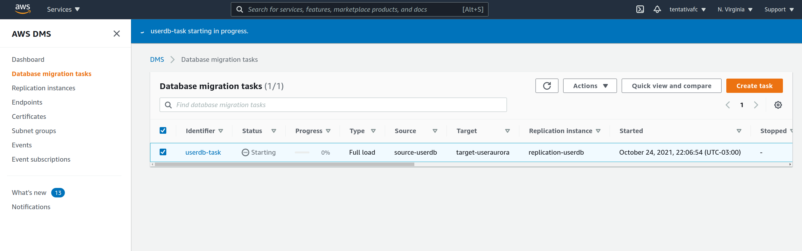
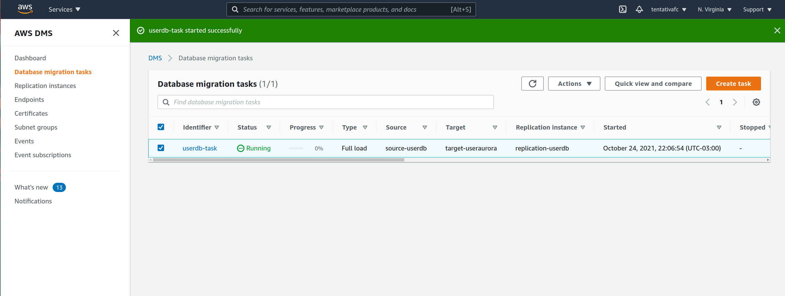
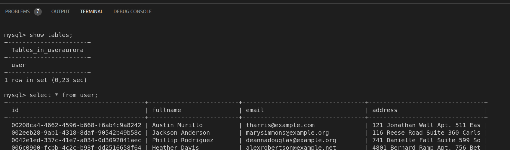

# RDS

This demo demonstrate how create DB Instance and Aurora RDS, and migrate a snapshot from DB Instance to Aurora.

## Create DB Instance

```sh
cd db_instance
terraform init
terraform apply -auto-approve
```

### Fake DB rows

```sh
cd automate/data-generator
conda create -n data-generator python=3.8.8
conda activate data-generator
pip install -r requirements.txt
python generate_inserts.py
```

### Connect to DB Instance and insert rows

```sh
mysql -h <db_instance_endpoint> -u ortisan -portisan123 userdb < automate/scripts/1-schema.sql
mysql -h <db_instance_endpoint> -u ortisan -portisan123 userdb < automate/scripts/2-inserts.sql

```

mysql -h userdb.cn9vnkebenrp.us-east-1.rds.amazonaws.com -u ortisan -portisan123 userdb < automate/scripts/1-schema.sql
mysql -h userdb.cn9vnkebenrp.us-east-1.rds.amazonaws.com -u ortisan -portisan123 userdb < automate/scripts/2-inserts.sql

mysql -h useraurora.cluster-cn9vnkebenrp.us-east-1.rds.amazonaws.com -u ortisan -portisan123

### Create snapshot

```sh
aws rds create-db-snapshot \
    --db-instance-identifier userdb \
    --db-snapshot-identifier userdbsnapshot
```

## Create Aurora From Snapshot

Get the ARN of snapshot, and edit **db_instance_snapshot_arn** variable into aurora folder

Create Aurora Cluster from DB Instance snapshot:

```sh
cd aurora
terraform init
terraform apply -auto-approve
```

**IMPORTANT: This procedure for restore from mysql 8.3 to Aurora Mysql 5.7 does not work because the major version. I will try from S3 bucket (TODO)**
**Error: Error creating RDS Cluster: InvalidParameterCombination: Cannot upgrade from mysql 8.0.23 to aurora-mysql 5.7.mysql_aurora.2.10.1.Specify a current active database version, the latest active minor version for mysql 8.0 is 8.0.23.**
**

### Docs:
https://docs.aws.amazon.com/AmazonRDS/latest/UserGuide/MySQL.Procedural.Importing.html

## Use DMS for Sync

```sh
cd dms
terraform init
terraform apply -auto-approve
```

After starting task, the tables will be migrate:

Starting task:


End taks:


Result:



### Docs:

https://docs.aws.amazon.com/dms/latest/userguide/CHAP_Introduction.HighLevelView.html