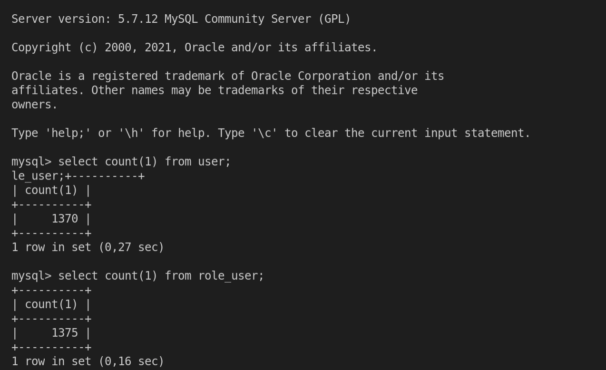

# RDS

This demo demonstrate how create DB Instance and Aurora RDS, and migrate a snapshot from DB Instance to Aurora.

## Create DB Instance

```sh
cd db_instance
terraform init
terraform apply -auto-approve
```

### Fake DB rows

```sh
cd automate/data-generator
conda create -n data-generator python=3.8.8
conda activate data-generator
pip install -r requirements.txt
python generate_inserts.py
```

### Connect to DB Instance and insert rows

```sh
mysql -h <db_instance_endpoint> -u ortisan -portisan123 userdb < automate/scripts/1-schema.sql
mysql -h <db_instance_endpoint> -u ortisan -portisan123 userdb < automate/scripts/2-inserts.sql

# Eg. Source
# Schema
mysql -h userdb.cn9vnkebenrp.us-east-1.rds.amazonaws.com -u ortisan -portisan123 userdb < automate/scripts/1-schema.sql
# Data
mysql -h userdb.cn9vnkebenrp.us-east-1.rds.amazonaws.com -u ortisan -portisan123 userdb < automate/scripts/2-inserts.sql

# Eg. Target
# Only schema. Data will be by DMS
mysql -h useraurora.cluster-cn9vnkebenrp.us-east-1.rds.amazonaws.com -u ortisan -portisan123 useraurora < automate/scripts/1-schema.sql

```

### Start DMS

Follow [DMS instructions](https://github.com/ortisan/aws-terraform-recipes/tree/main/dms/README.md)

### See results

```sh
mysql -h useraurora.cluster-cn9vnkebenrp.us-east-1.rds.amazonaws.com -u ortisan -portisan123 useraurora
select count(1) from user;
select count(1) from role_user;
```



### Create snapshot

```sh
aws rds create-db-snapshot \
    --db-instance-identifier userdb \
    --db-snapshot-identifier userdbsnapshot
```

